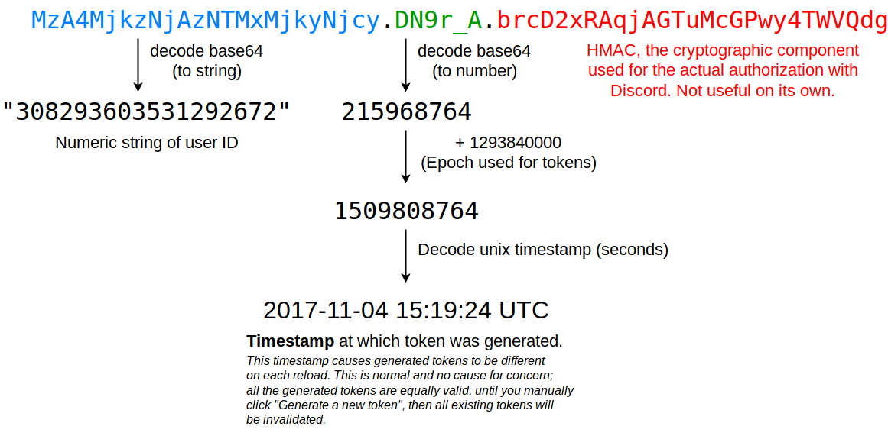
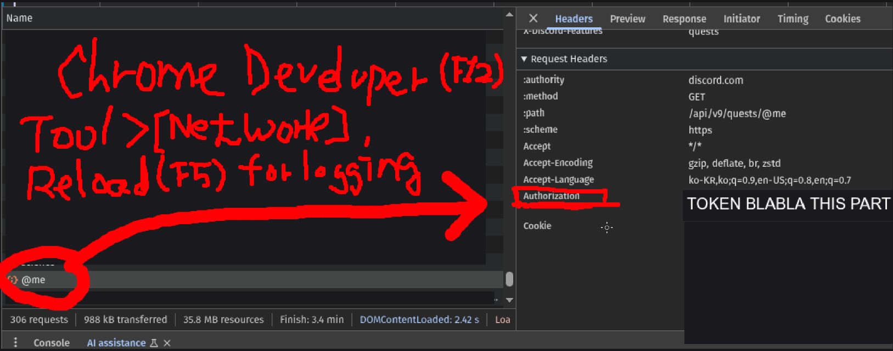

# **DC2S - Discord Chat To Shorts Video**

---

## 📖 Description
**DC2S** is a Python-based tool that converts Discord chat logs into short-form videos.  
It leverages **MoviePy**, **OpenAI APIs**, and other libraries to process chat data and automatically render videos.  

---

## ⚙️ Environment Setup
Install dependencies using the provided `requirements.txt` file:

    pip install -r requirements.txt

Or install manually:

    annotated-types==0.7.0
    anyio==4.10.0
    certifi==2025.8.3
    charset-normalizer==3.4.3
    decorator==5.2.1
    distro==1.9.0
    dotenv==0.9.9
    exceptiongroup==1.3.0
    h11==0.16.0
    httpcore==1.0.9
    httpx==0.28.1
    idna==3.10
    imageio==2.37.0
    imageio-ffmpeg==0.6.0
    jiter==0.10.0
    moviepy==2.2.1
    numexpr==2.13.0
    numpy==2.2.6
    openai==1.102.0
    pillow==11.3.0
    proglog==0.1.12
    pydantic==2.11.7
    pydantic_core==2.33.2
    python-dotenv==1.1.1
    requests==2.32.5
    simpleeval==1.0.3
    sniffio==1.3.1
    tqdm==4.67.1
    typing-inspection==0.4.1
    typing_extensions==4.15.0
    urllib3==2.5.0

You will also need a `.env` file based on `.env_example`.  
> **Note:** Many properties are required to run this program.  
> The descriptions of these properties are in `.env_example`.  
> The most important property is **`TOKEN`**, which requires your personal Discord authorization token.  

To obtain your Discord token:
1. Open **Browser Developer Tools (F12)**.  
2. Go to the **Network** tab and refresh the page (F5).  
3. Look for the `@me` request.  
4. Copy the `Authorization` value from the request headers.  

  
  
> **Note**: Using a personal Discord token may lead to your account **being banned** by the Discord team, and you are solely responsible for any consequences.  
> It is recommended to use a Discord bot token instead; however, this project does not currently support bot tokens.

---

## 🖥️ System Requirements

Rendering requires **high memory (RAM)**.  

⚠️ Not recommended for **WSL** due to limited RAM and swap memory.  

✅ Best performance on native OS (Windows, macOS, Linux) with sufficient memory.  

---

## 🚀 Usage

Prepare your Discord chat data (JSON export or API call).  

Run the main script to generate a video:

    python src/main.py

During execution, the program automatically creates directories such as `chats/`, `scenarios/`, and `output/`.  
These are mainly for debugging purposes, so you don’t need to manage them manually.  

Generated videos will be saved in the `output/` directory.  

### 🎬 Example Output

The program converts raw chat logs → formatted scenarios → rendered short-form videos.  
Supports both text and sound effects.  

You can find many example videos created with this tool on my YouTube channel:  
> *https://www.youtube.com/@ho3_txle*

---

## 📄 License

This project is licensed under the Creative Commons Attribution-NonCommercial (CC BY-NC 4.0) License.  

You are free to share and adapt the work for non-commercial purposes only, with attribution.  
For the full license text, see: [CC BY-NC 4.0 License](https://creativecommons.org/licenses/by-nc/4.0/)  
